#File Backup Logger

## Description
A program that backs up files and directories with versioning, logs the operations locally, and includes a GUI. 

**Prepared for:** Jesus Alamo, EuTech Engineers
**Developer:** Gvantsa Lukhava
**Architechture:** OOP Python (Terminal testing + TKinter Gui Wrapper)

##  System Architecture & Code Features

##  Features
- **Flexible Backup:** Choose between raw directory copies or compressed `.zip` archives.
- **Detailed Logging:** Every operation is tracked in `backup_log.txt` with timestamps, file counts, and backup duration.
- **Error Resilient:** Built-in handling for permission errors and missing directories.
- **Persistence:** Remembers your last-used source folder and compression preference using `config.json`.
- **Modern Interface:** Built with `tkinter` for a simple, native desktop experience.

##  Prerequisites
- **Python 3.x**
- No external libraries required (uses standard library modules: `tkinter`, `pathlib`, `shutil`, `json`, `datetime`, `time`).

##  Project Structure
- `backup.py`: The core engine handling file system operations and logging.
- `gui.py`: The user interface layer.
- `config_manager.py`: Handles saving and loading user preferences.

##  How to Use
- Launch the application by running python gui.py

## GUI
1. **STEP 1: Browse into files**
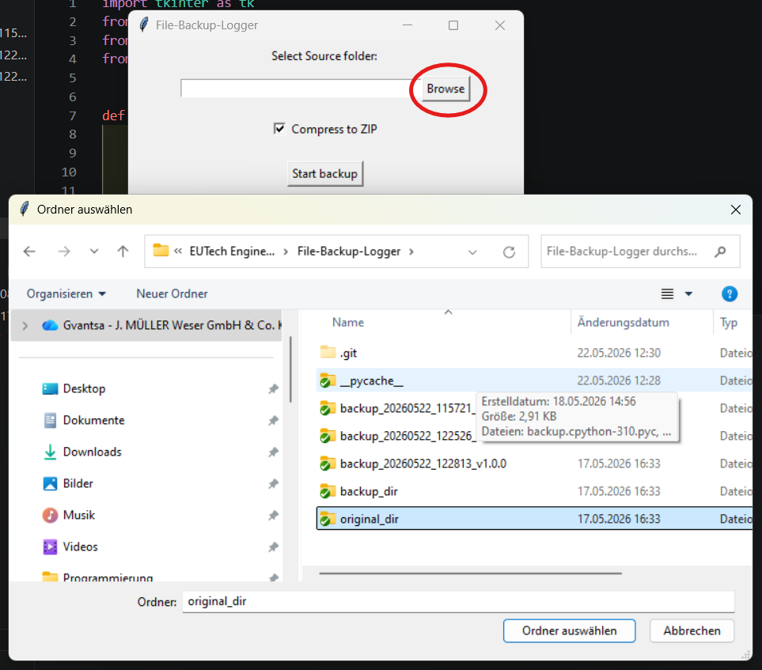
2. **STEP 2: Select either to zip the backup or not:**
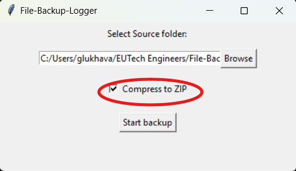
4. **STEP 3: Start the backup and compelete successfully:**
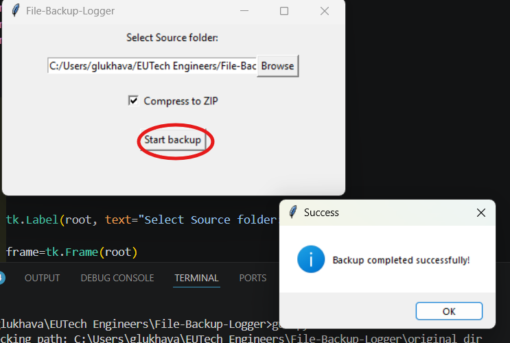
5. **STEP 4: To Backup file doesnt exist:**
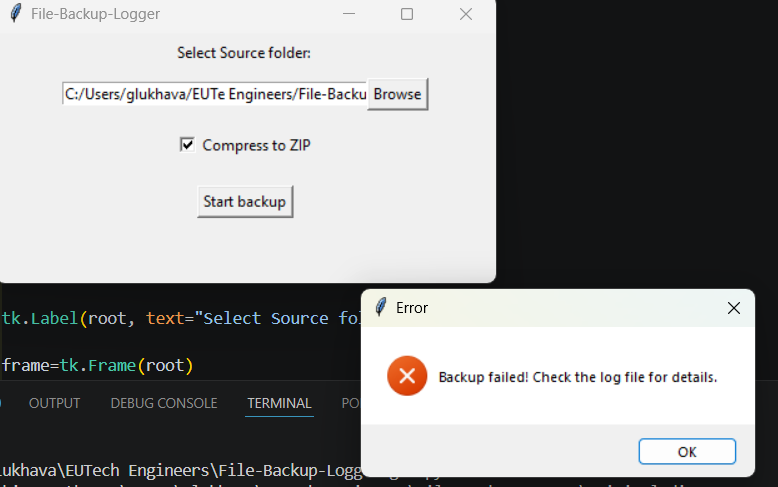
6. **STEP 5: folder not selected :**
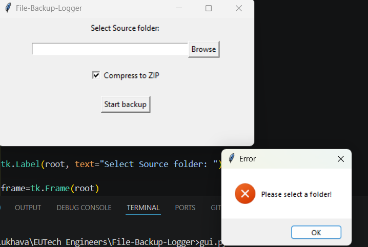

**CODE**
1. **Class Backup**
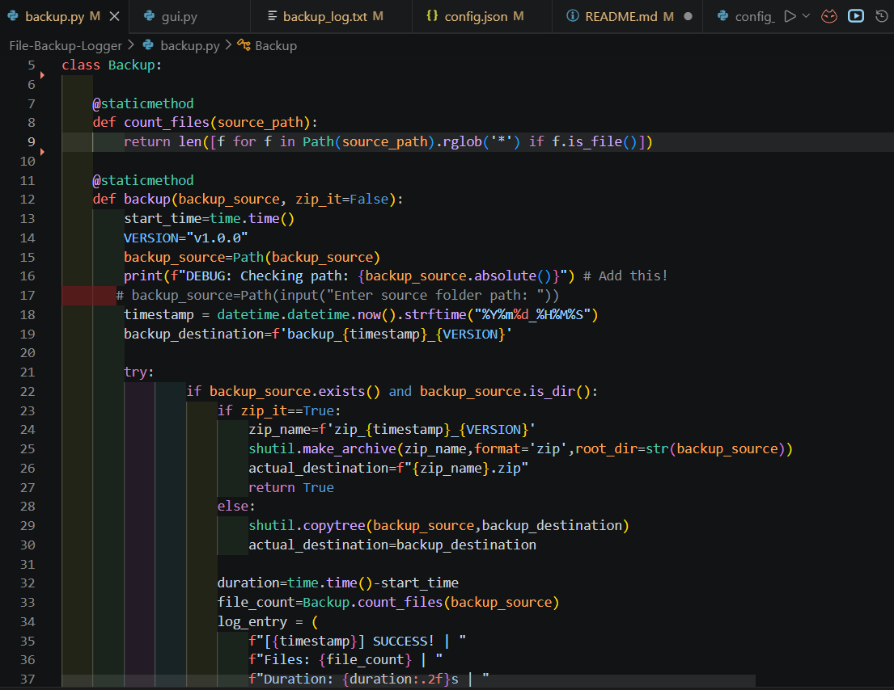
1.1 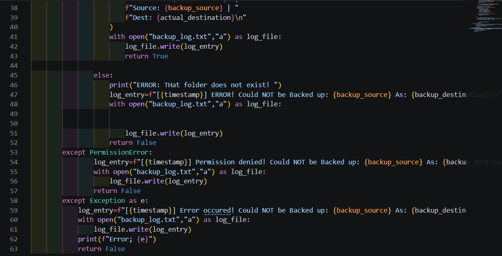
2. **testing backup before integrating to GUI**
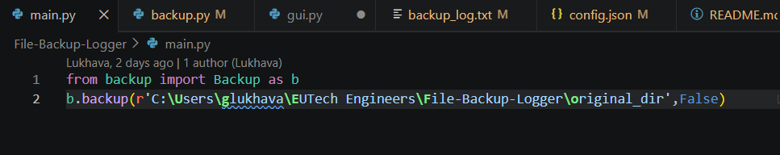
3. **log files:**
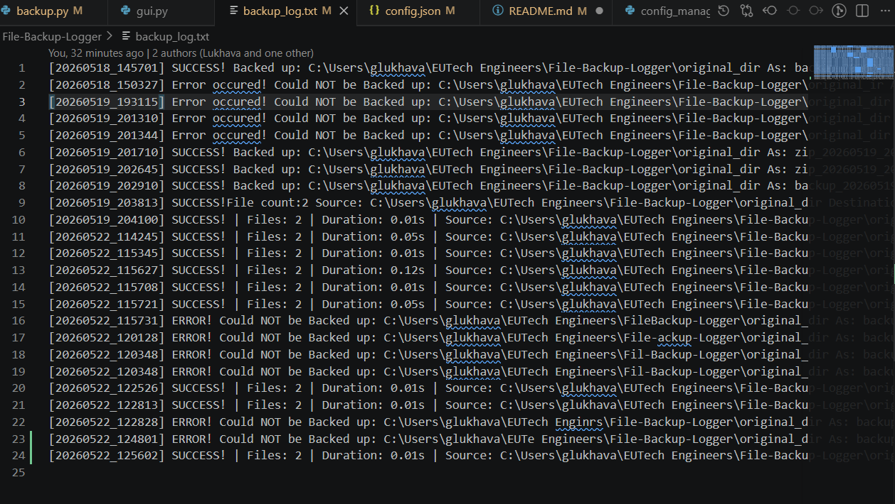
4. **GUI()**
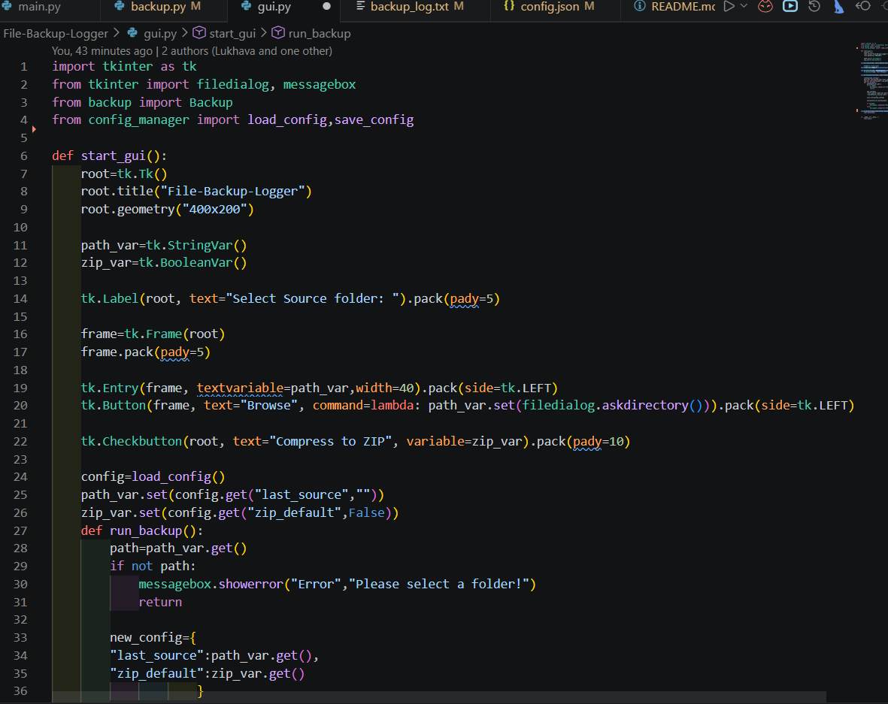
4.1. 
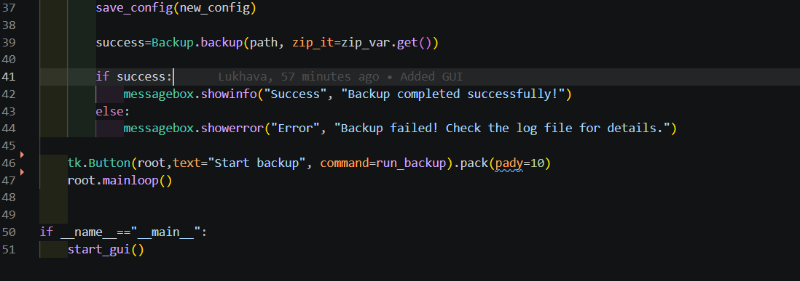
5. **JSON Config manager**
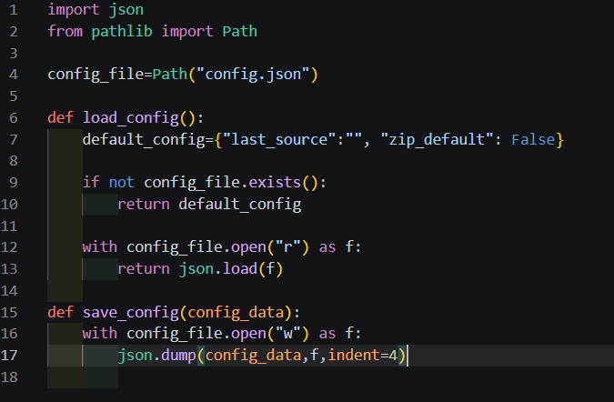
5.1 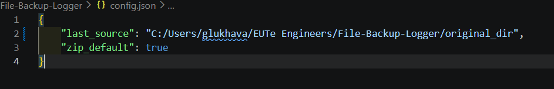

